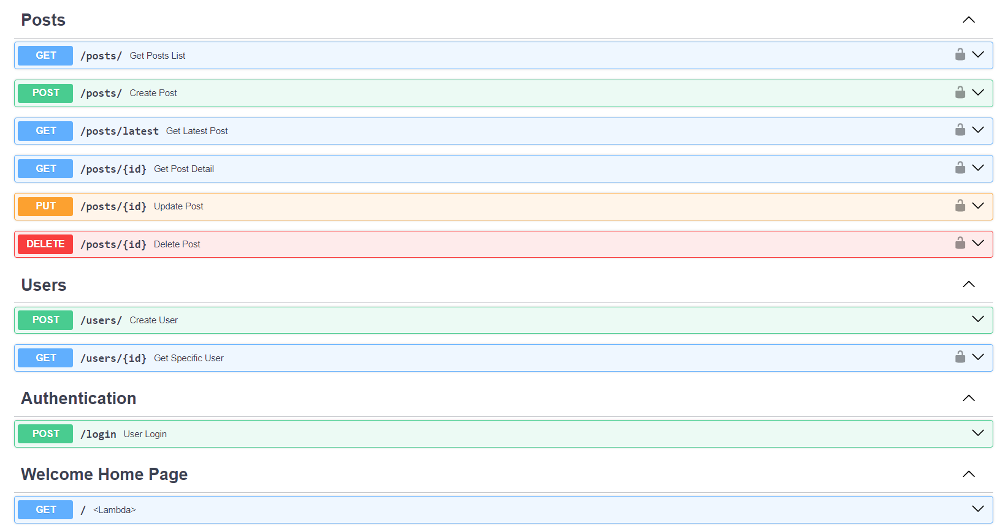
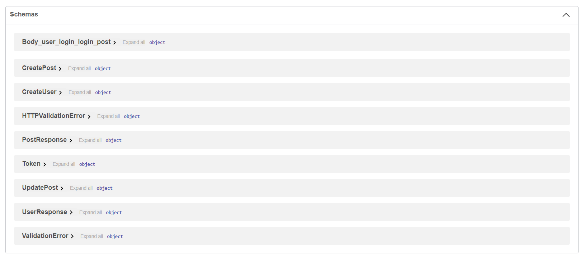

# Social Media App API using FastAPI

## Documentation

- [Collection of API Testing Endpoints in Insomnia json file that can be imported any API test tool like Postman](/docs/README.md)

### FastAPI endpoints/routes

### Pydantic Schemas

## Tech stack

- FastAPI
- Pydantic
- PostgreSQL
- SQLAlchemy
- Alembic

## TO DO Features

- [x] CRUD Operations
- [x] Authentication
- [ ] Validation
- [ ] Documentation
- [ ] Testing
- [ ] Deployment on Cloud VPS or Hosting
- [ ] Conteinerize with Docker
- [ ] Configure Nginx and Uvicorn ASGI
- [ ] GitHub action CI/CD

## How to run locally

- Create venv and install dependencies in requirements.txt or use poetry
- Run fastapi uvicorn server: `uvicorn app.main:app`
- Run it in automatic reload mode when you change code with reload flag: `uvicorn app.main:app --reload`
- Also you can specify port by: `--port 5000` by default: is `8000`

---

- Also, you need provide Postgres db data like db_name, user_name, password etc.

---

- How to stop background uvicorn server in windows (powershell) if any error or is still running in background:
- <kbd>CTRL + C</kbd> to quit.
- `netstat -ano | findstr :8080`
- `Stop-Process -id <PID>` or `kill <PID>`
