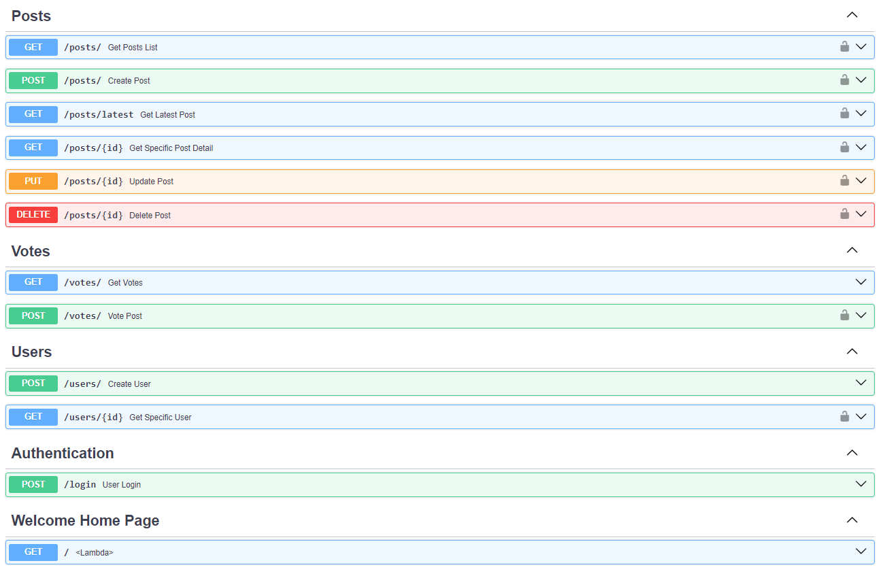
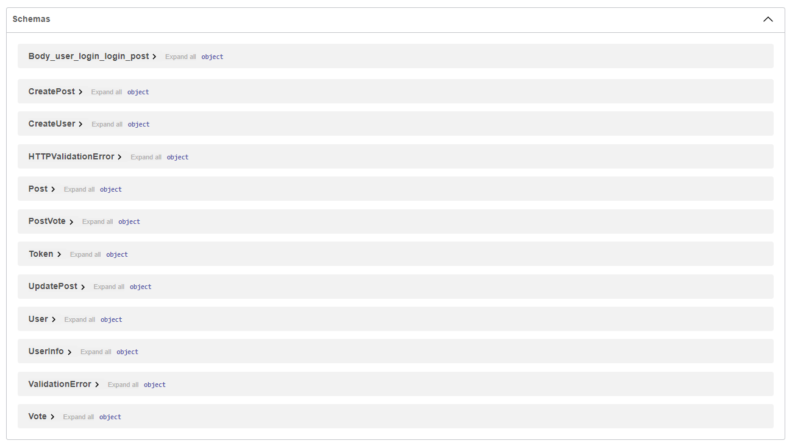

# Social Media App API using FastAPI

Demonstration of project in website here [https://dotpep.xyz] link and API docs in below:

- Swagger/OpenAPI docs: [https://dotpep.xyz/docs]
- Redoc docs: [https://dotpep.xyz/redoc]
- API testing tool/client [Collection of requests/endpoints and Automatiom to testing API](/docs/README.md)

---

- Docker image: [https://hub.docker.com/repository/docker/dotpep/social-media-fastapi]

## Demonstration

### FastAPI endpoints/routes



### Pydantic Schemas



## Tech stack

- FastAPI
- Pydantic
- PostgreSQL
- SQLAlchemy
- Alembic

## Features

## TO DO

- [x] CRUD Operations
- [x] Authentication with OAuth2 JWT Token
- [x] Validation with Pydantic
- [x] Alembic Migrations
- [x] Documentation with Auto generated FastAPI docs and with API testing collection .json file using Insomnia
- [ ] Testing with PyTest and UnitTest
- [x] Deployment on Cloud VPS or Hosting
- [x] Conteinerize with Docker
- [x] Configure Nginx and Uvicorn ASGI
- [ ] GitHub action CI/CD
- [ ] Apply SOLID principles, best practices and Common Patterns for Backend/API
- [ ] Fetch API with GraphQL

## How to run locally

1. Clone this repo by: `git clone "https://github.com/dotpep/social-media-api.git"`

---
With Docker (Easy way to run)

1. Install Docker
2. Run dev-server: `docker-compose -f .\docker-compose-dev.yml up` by specify `-d` flag it runs in background and to see logs `docker-compose -f .\docker-compose-dev.yml logs -f`
3. Stop: `docker-compose -f .\docker-compose-dev.yml down`

- Also for convenience you can delete `docker-compose-prod.yml` and rename `docker-compose-dev.yml` to `docker-compose.yml` and use short command `docker-compose up` without `-f .\docker-compose-dev.yml`
- If you want use `.env` as environment variables in `docker-compose-dev.yml` uncomment `#env_file: # - ./.env` this line and comment `environment` section

---
Without Docker (Localy)

1. Create Database and setup environment variables on `.env.example` file.
2. Make Migrations of database models using Alembic
3. Run Uvicorn server for FastAPI and Install Dependencies requirements.txt to Virtual Environment venv

---

- You need provide Postgres database secret data like db_name, user_name, password etc into `.env` file.
- In below instruction section:

### Setting up Environment variables files (In Development)

> In Production, you must set this environment variables in Your machine/server as Permanent System-wide Environment Variables, in Development you can just use `.env` file

- Change this file in base dir of project with your required config variables: `.env.example`
- After setting your env variables data rename this `.env.example` file to `.env.`
- Provide values to empty variable values (create postgres database)

---
Postgres Database env variables

```.env
DATABASE_HOSTNAME=localhost
DATABASE_PORT=5432
DATABASE_PASSWORD=
DATABASE_NAME=
DATABASE_USERNAME=postgres
```

---
JWT Token env variables

- You can use just my setting for JWT token or use own
- to generate SECRET_KEY you can use this command `openssl rand -hex 32`

```.env
SECRET_KEY=9b68c9f53ff13f75b890b62af1d9435d65827796d21ceb16c5fe431f054dcde3
ALGORITHM=HS256
ACCESS_TOKEN_EXPIRE_MINUTES=60
```

---

- If somthings doesn't work try to delete `# Comment` in `.env` file I think this may help

---

- Create venv and Install dependencies
- In below instruction section:

### Create Venv and Install dependencies package from requirements.txt or use Poetry

- Using poetry (run step by step)

1. Install poetry: `pip install poetry`, Check poetry installation: `poetry --version`, if needed add poetry to env variable
2. (Optional) Setup poetry to create venv inside project: `poetry config virtualenvs.in-project true`
3. Generate venv: `poetry shell`
4. Install all depe`poetry install`
5. (Additonal Information) to exit activated venv you can write: `exit`

---

- Using python venv/pip (run step by step)

1. Create venv: `python -m venv venv`
2. Activate venv: `.\venv\Scripts\activate` (in VS code specify this venv in Python Intepreter command) also you activate specific `\Scripts\activate` like with `.ps`, `.bash`, `.bat`
3. Install all needed package/dependency to venv: `pip install -r requirements.txt`
4. (Additonal Information) to exit activated venv you can write: `deactivate`

---

- And migrate this database tables/entity using Alembic
- In below instruction section:

### Alembic Postgres database, SQLAlchemy models Migrations

- migrate to last rivision: `alembic upgrade head`

### Running uvicorn server

- Run fastapi uvicorn server: `uvicorn app.main:app`
- Run it in automatic reload mode when you change code with reload flag: `uvicorn app.main:app --reload`
- Also you can specify port by: `--port 5000` by default: is `8000`

---

- How to stop background uvicorn server in windows (powershell) if any error or is still running in background:
- <kbd>CTRL + C</kbd> to quit.
- `netstat -ano | findstr :8080`
- `Stop-Process -id <PID>` or `kill <PID>`
